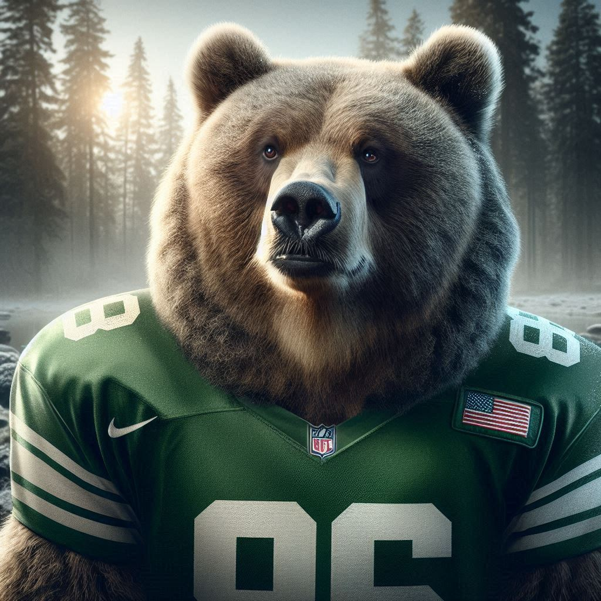
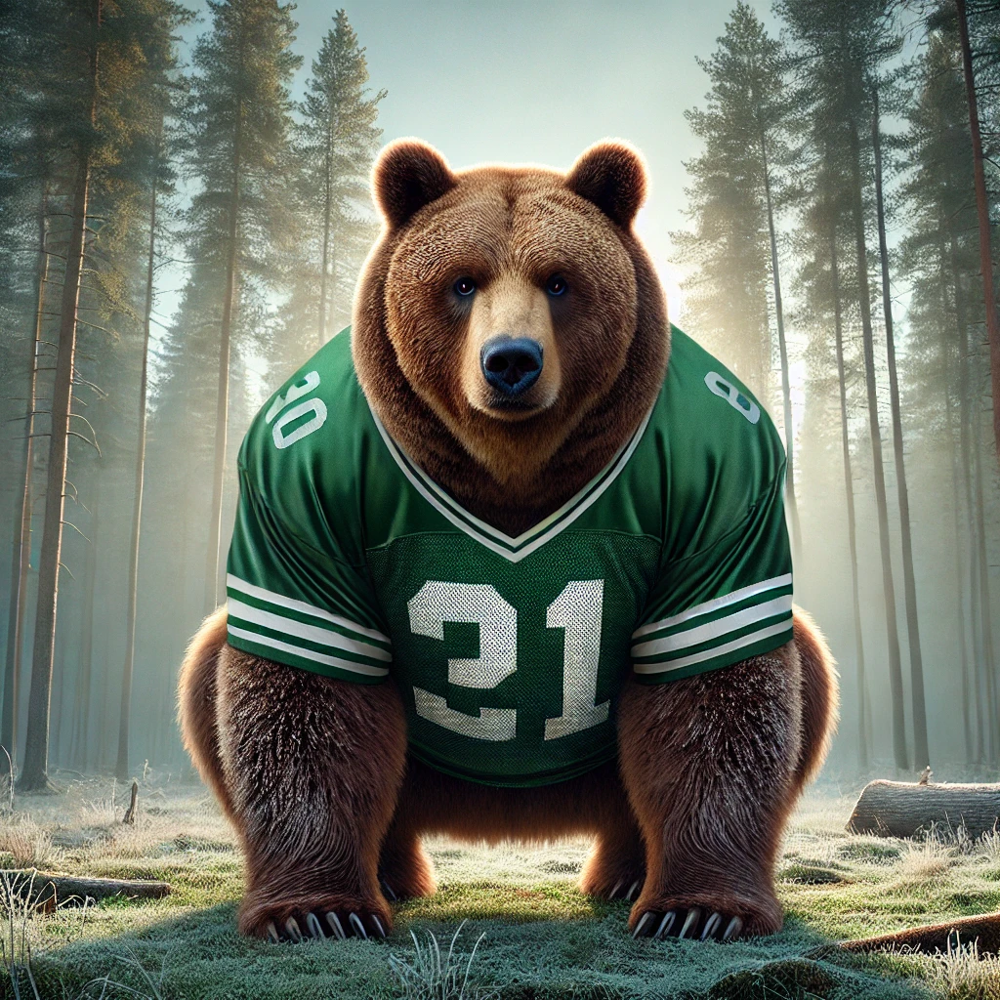

# natty-ou-fake-natty
Desafio de fazer algo parecer o mais natural possível com IA generativa

## 📒 Descrição
Desafio do **Bootcamp Santander Fundamentos de IA para devs**

## 🤖 Tecnologias Utilizadas
<div style="display: flex">
    
    
</div>

## 🧐 Processo de Criação
Devido a **teoria do "vale da estranhesa"** - algo não humano, tentar ser o mais humano possível, causar estranhesa aos olhos por não ser exatamente igual ao humano, escolhi utilizar um animal bonito e icônico como um urso pardo.

**Prompt:**
``` 
Crie uma imagem de um urso pardo vestindo uma camiseta verde de futebol americano, de quatro olhando para frente, em uma floresta ao fundo, em uma manhã fria, no canadá,  em um estilo ultra realista
```

## 🚀 Resultados
### Copilot


### ChatGPT


## 💭 Reflexão
Foi muito interessante testar a função de geração de Imagens do ChatGPT, não chega ser melhor que o Bing (que deixa gerar até 14 imagens e com maior detalhes e texturas), mas é interessante o estilo das imagens em sí do ChatGPT.

## 🗂 Estrutura do Projeto
```
/
├── assets/
│   └── images/           # Imagens utilizadas (chatGPT e Copilot)
|   └── logos/            # logos utilizados
│   
└── README.md             # Este arquivo
    
```
